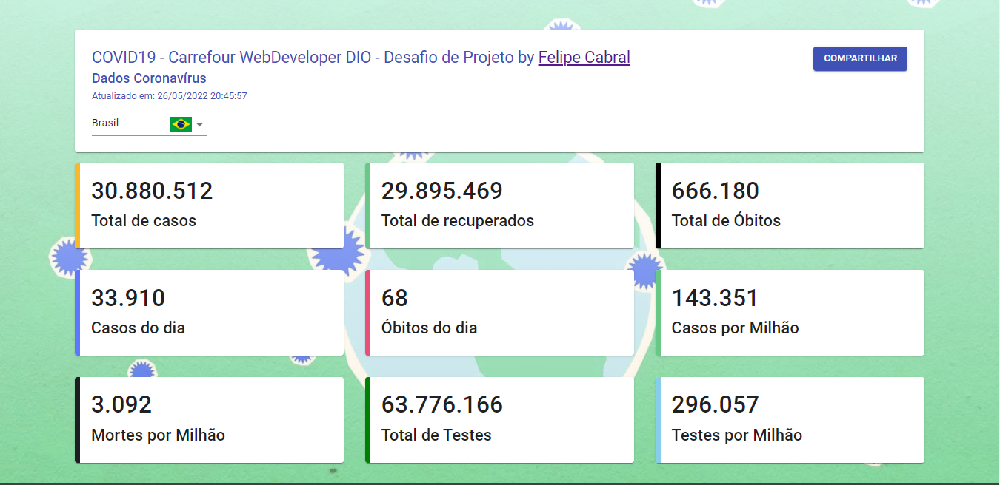
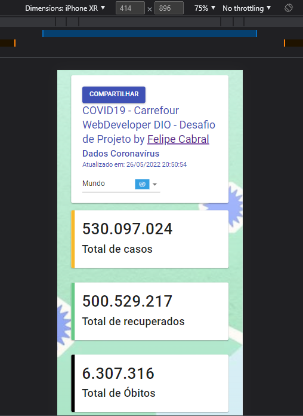

## Painel de Monitoramento de casos de COVID19 em React 

Desafio de Projeto.

## Desenvolvendo uma Progressive Web Application com React para mapear os dados do COVID19 pelo mundo

**Descrição**:

Mantenha-se informado a respeito de todos os casos do COVID19 pelo mundo criando uma "Progressive Web Application (PWA)" utilizando React e aprenda como criar uma aplicação para ser executada no browser e funcionar como aplicativo contendo algumas funcionalidades de um aplicativo nativo. Tudo rápido e fácil, sem precisar subir para a Play Store ou App Store.

Tecnologias e ferramentas utilizadas:

- HTML5
- CSS3
- JavaScript
- React
- Progressive Web App (PWA)
- Photoshop
- Visual Studio Code

**GitHub Pages**

Confira como ficou o projeto acessando o link do GitHub Pages, uma visão do projeto pronto e funcionando:

Link: https://felipecabraloliveira.github.io/mapeamento-covid19/

### API utilizada no projeto

API: https://coronavirus-19-api.herokuapp.com/tabs/tab2

Author: Javier Aviles

Descrição: A API retorno dados sobre a COVID 19, podemos obter eles de acordo com cada país.

### Página

**Página principal do projeto.**

- São 9 cards com dados de infectados, recuperados, óbitos, casos por milhão e testes realizados.
- Por default os dados do Brasil estão selecionados na abertura da página.

**Seleção de Países.**

- Total de 16 países para seleção, a opção **Mundo** retorna todos os dados disponibilizados sobre a Covid 19 no mundo.
- Imagens tratadas no Photoshop.

### Responsividade

Exemplo de tela para Iphone.

- Ajuste para responsividade.

> Instrutor: Bruno Carneiro

> Bootcamp Carrefour Web Developer

